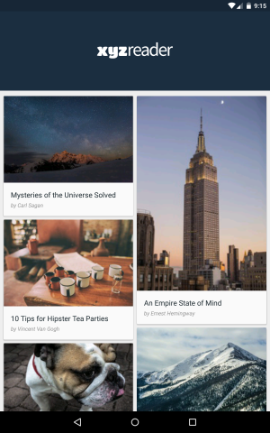

# Material Design

The purpose of this app was to teach me [Material Design](https://material.google.com) and animations in Android.

## Screenshots
 

## Build Instructions
- Clone the repository
- Install [Java](https://java.com/en/download/help/download_options.xml)
- Install [Android Studio](http://developer.android.com/sdk/index.html) with Android SDK Tools
- Start Android Studio, build the project and run it in the emulator or your phone
- Install the debug version of the app using `./gradlew installDebug`

## Features
- Standard Material Design specific layouts and elevations
- Parallax image effect using Collapsing Toolbar Layout and Coordinator Layout
- View animations and transitions
- Article list made with Recycler View
- Pull to Refresh made with RecyclerView
- Layout support for mobile phones and tablets, both portrait and landscape
- Call to action using Floating Action Button with custom behavior
- Displaying of standard error messages using SnackBar
- Full Screen View Pager providing a horizontal scroll to view another set of article

## License

Copyright 2017 MDesign

Licensed under the Apache License, Version 2.0 (the "License");
you may not use this file except in compliance with the License.
You may obtain a copy of the License at

    http://www.apache.org/licenses/LICENSE-2.0

Unless required by applicable law or agreed to in writing, software
distributed under the License is distributed on an "AS IS" BASIS,
WITHOUT WARRANTIES OR CONDITIONS OF ANY KIND, either express or implied.
See the License for the specific language governing permissions and
limitations under the License.
